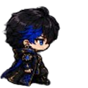

# LastCoRE Character Web Pack

ชุดไฟล์ตัวละครสำหรับใส่เว็บ / Dashboard / Visual Office โดยตรง ไม่ต้องใช้ภาพใหญ่แล้วครอบในเว็บ

## โครงสร้างไฟล์

- `animations/webp/` = ไฟล์อนิเมชั่นโปร่งใสแบบสำเร็จ ใช้กับ `` ได้ทันที
- `animations/gif/` = ไฟล์ GIF สำรอง
- `spritesheets/` = แถว Sprite Sheet แยกทิศทาง สำหรับ CSS animation
- `frames/` = เฟรมแยกเป็น PNG/WebP
- `static/` = ตัวละครนิ่งแบบตัดขอบโปร่งใส
- `source/` = ไฟล์ต้นฉบับที่อัปโหลด
- `lastcore-characters.css` = CSS พร้อมใช้
- `characters.json` = metadata สำหรับเอาไปให้ระบบอ่าน
- `demo.html` = หน้า preview เปิดดูได้ทันที

## วิธีใช้แบบเร็วสุด

```html

```

## วิธีใช้แบบ CSS Sprite

วางไฟล์ `lastcore-characters.css` ไว้ใน path เดียวกับโฟลเดอร์ `spritesheets/`

```html
<link rel="stylesheet" href="lastcore-characters.css">
<div class="lc-character sirius right"></div>
```

เปลี่ยนทิศทางได้ด้วย `front`, `left`, `right`, `back`

```html
<div class="lc-character sirius front"></div>
<div class="lc-character sirius left"></div>
<div class="lc-character sirius right"></div>
<div class="lc-character sirius back"></div>
```

## ปรับขนาด

```html
<div class="lc-character sirius right small"></div>
<div class="lc-character sirius right"></div>
<div class="lc-character sirius right x2"></div>
```

## ตัวละครที่มีในชุดนี้

altair, antares, capella, draco, polaris, sirius

## ขนาดมาตรฐาน

- 1 เฟรม = 125 x 125 px
- 1 animation = 4 เฟรม
- ความเร็วเริ่มต้น = 160 ms ต่อเฟรม
